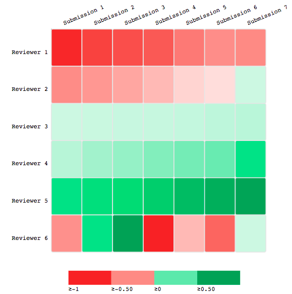

# HeatMap Matrix Chart

####For Users and Developers:

**Purpose:** 
This chart is used to map relation between two entities where the intersecting point between the variables on x and y axes can be denoted by a specific numerical value along with informative text. The numerical value should belong to some range (specific minimum and maximum). The value will be denoted by a color mapped to that particular value so that it's easier to compare different values belonging to different ranges.

**Example:** 
Suppose you have a list of assignment for a student. Once the student submits the assignment, it is reviewed by multiple reviewers. Each reviewer adds his/her own comments as review. After analyzing the comment of each reviewer for each submission, we get the tone of all the reviews (positive/negative/neutral). The tone is mapped from -1 to 1 with -1 denoting most critical negative review and 1 denoting the most positive review.

If you want to see all this information using a chart, then heatmap matrix chart  can be very useful. You can specify your information in following json format.

**JSON Format for Input Data:** 

<pre>
{
                "v_labels": ["Reviewer 1", "Reviewer 2", "Reviewer 3",
                "Reviewer 4" , "Reviewer 5", "Reviewer 6"
                ]
                , "h_labels": ["Submission 1", "Submission 2", "Submission 3",
                 "Submission 4", "Submission 5", "Submission 6", "Submission 7"
                ]
                , "font-face": "Arial"
                , "showTextInsideBoxes": true
                , "showCustomColorScheme": false
                , "tooltipColorScheme": "black"
                , "custom_color_scheme": {
                    "minimum_value": -1
                    , "maximum_value": 1
                    , "minimum_color": "#FFFF00"
                    , "maximum_color": "#FF0000"
                    , "total_intervals": 5
                }
                , "color_scheme": {
                    "ranges": [{
                        "minimum": -1
                        , "maximum": -0.5
                        , "color": "#E74C3C"
                    }, {
                        "minimum": -0.5
                        , "maximum": 0
                        , "color": "#F1948A"
                    }, {
                        "minimum": 0
                        , "maximum": 0.5
                        , "color": "#82E0AA"
                    }, {
                        "minimum": 0.5
                        , "maximum": 1
                        , "color": "#229954"
                    }]
                }
                , "content": [
                    [  {
                         "value": -0.99
                        ,"text": "The results were stated but not really
                                  discussed or explaned. It didn't seem like 
                                  the issue of accuracy or precision were
                                  addressed with regards to the unknowns.
                                  The standard deviation was small but that
                                  just tells us that the experimenter did
                                  the same thing for all 3."
                     }, {
                          "value": -0.9
                        , "text": "No real problems with the analysis
                                   were discussed, and sources of error
                                   were barely touched on."
                    }, {
                        "value": -0.85
                        , "text": "Test cases are not written.
                        		   Poor coding styles."
                    }, {
                        "value": 0
                        , "text": "Overall satisfactory feature development."
                    }, {
                        "value": 0.65
                        , "text": "Good commenting styles."
                    }, {
                        "value": 0.55
                        , "text": "The fact that there were no bugs
                        		   found is appreciable."
                    }, {
                        "value": -0.5
                        , "text": "Your writing style is very fluid and easy to
                                   follow. There was mostly passive voice used,
                                   but the addition of active voice in select
                                   areas did not seem out of place and rather
                                   let me put my focus onto the writer as
                                   intended. Overall, everything seemed very
                                   well put together."
                    }]
                    .
                    .
                    .
                    .
                    .
                ]
            }
</pre>

**JSON Explanation:** 

| Key  | Meaning 
|---|---|---|
| `h-labels`  | The labels on the X axis. |
| `v-labels`  | The labels on the Y axis. |
|  `font-face` | The font face you want in the chart for all the displayed text |
|  `showTextInsideBoxes` |   If this flag is set to true, then the heatmap will show context text inside the boxes, else it will be available as a tooltip. Tooltip will also be available for long text irrespective of the value of this flag.
|  `showCustomColorScheme` |  Set this flag to true if you want to provide only minimum and maximum color for the chart and let the chart service calculate in between colors for you. In this case, fill up all the values in the `custom_color_scheme` key. If this key is set to False, you will have to provide the color for each range of values.
|  `tooltipColorScheme` |   This sets the background color for the tooltip box, available options are `blue, red, aqua, black, leaf, purple, pink, orange`. If not specified, default will be red.
| `custom_color_scheme`  | This specifies details about the custom color scheme as following:<ul><li>`minimum_value`: This specifies the minimum value in your data (-1 in case of tone of reviews)</li><li>`maximum_value`: This specifies the maximum value in your data (+1 in case of tone of reviews)</li><li>`minimum_color`: Color corresponding to `minimum_value`</li><li>`maximum_value`: Color corresponding to `maximum_value`</li><li>`total_intervals`: The number of intervals you want to have between minimum and maximum values.</li></ul> 
|`color_scheme`| Array of ranges. Each range has its maximum and minimum value and color. If you have set `custom_color_scheme` as false, you will to pass all the ranges and their corresponding colors. Using color_scheme is recommended over custom color scheme to get greater control over the appearance of heatmap.|
|`content`| This is 2D Array consisting information about each box in the heatmap - which is an intersection of x and y values. Outer array contains rows and inner array contains columns for that particular row. Each element in the inner array has to be an object having `text` and `value` attributes, value being reflected in the color and text being shown as a tooltip and/or inside the  boxes.|

  
**Screenshot (Without text inside boxes):** 

To use this chart, change the data.json file as per your own data. If you want to change the size of the chart, then change the height and width of the "parent" div element in index.html file.

After modifying app.js, run following command to update bundle.js file.

<pre>node_modules/.bin/browserify main.js -o bundle.js
node server.js</pre>

Visit `http://localhost:8000` in your browsert to view the chart.